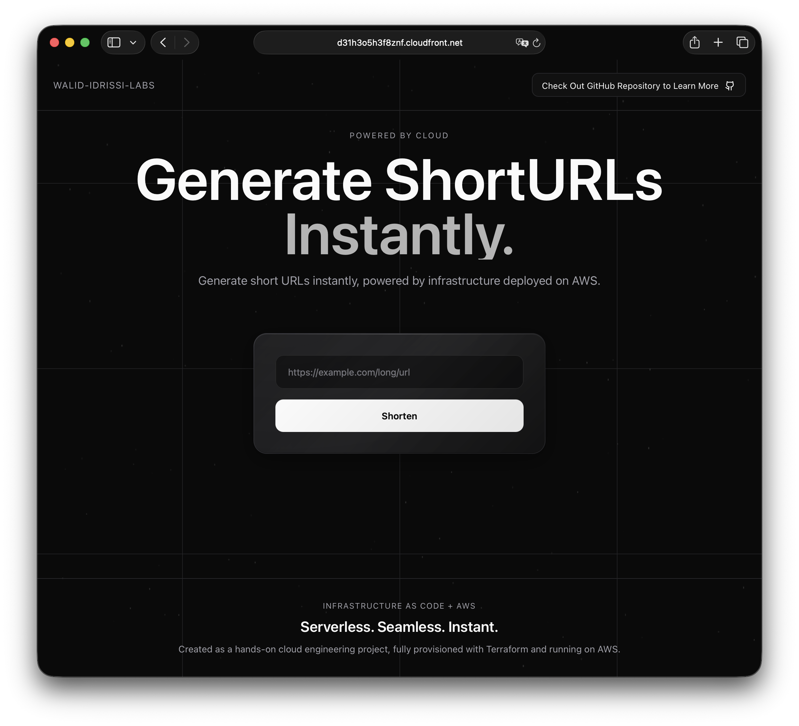
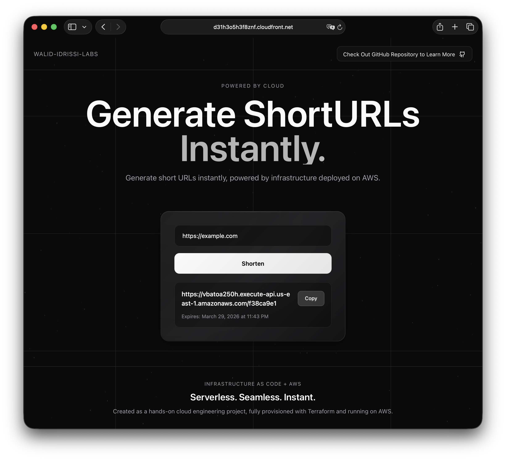
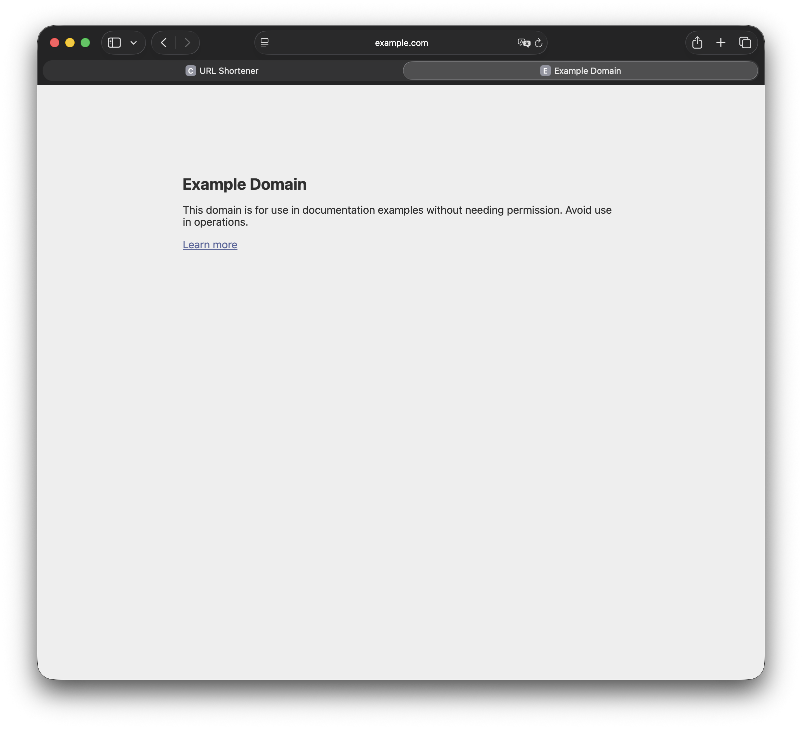
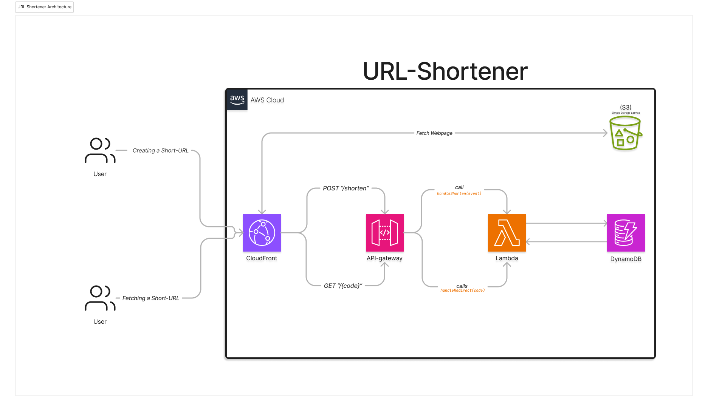

# URL Shortener — AWS + Terraform

A serverless URL shortener built with AWS and Terraform. You paste a long URL, you get a short one back. When someone visits the short URL, they get redirected to the original. That's it.

I built this as a way to get hands-on with AWS infrastructure and Terraform HCL, specifically around how different AWS services talk to each other and how IAM sits between all of them as the permission layer. It's not trying to be production-grade, but the architecture decisions are real ones.

---

## Screenshots

**Creating a short URL**

**Result — the short URL is generated**

**Usage - Clicking the short URL**

---

## AWS Architecture

There are two separate request paths for how this works.

**Path 1 — Loading the app:**
The React frontend is built with Vite and uploaded to a private S3 bucket. CloudFront sits in front of it as a CDN (*Content Delivery Network*), serves the files over HTTPS, and **caches** them at edge locations. 
The S3 bucket has no public access — CloudFront authenticates to it using an Origin Access Control (OAC), which signs requests with AWS SigV4. The bucket policy only allows requests from our specific CloudFront distribution ARN.

**Path 2 — Shortening and Redirecting:**
The React app calls an HTTP API (API Gateway) which has two routes: 
- `POST /shorten` to create a short code.
- `GET /{code}` to redirect. Both routes point to the same Lambda function, which reads the method and path from the event and branches accordingly. 
Lambda reads from and writes to a DynamoDB table. Nothing in this path is inside a VPC.  Lambda, API Gateway, and DynamoDB all live on AWS's internal managed network. The only publicly reachable thing is the API Gateway URL.

#### Note on IAM *Identity and Access Management*
All service-to-service *(e.g.: CloudFront with S3)*  communication goes through IAM. 
Lambda has a role attached with exactly two DynamoDB permissions (`PutItem`, `GetItem`) scoped to the specific table ARN. 
API Gateway has a resource-based permission to invoke Lambda. 
CloudFront has a bucket policy granting it `s3:GetObject`. 
None of these are broader than they need to be, Respecting the Principle of **least privilege**

---

## Stack

- **React** (Vite) — frontend
- **AWS S3** — static file hosting
- **AWS CloudFront** — CDN + HTTPS
- **AWS API Gateway v2** — HTTP API / public endpoints
- **AWS Lambda** (Node.js 20.x) — business logic
- **AWS DynamoDB** — URL storage (PAY_PER_REQUEST billing)
- **AWS IAM** — permissions between all of the above
- **Terraform** — all infrastructure defined as code **IaC**

---

## System & Architecture Overview

### Shortening a URL

1. User submits a URL in the React UI
2. React `fetch()`es `POST /shorten` on the API Gateway endpoint
3. API Gateway matches the route and invokes the Lambda function
4. Lambda generates a random 8-character hex code with `crypto.randomBytes(4).toString("hex")`
5. Lambda writes `{ short_code, url, expires_at }` to DynamoDB
6. Lambda returns `{ code: "a3f2c1d0" }` to API Gateway, which forwards it to the browser
7. React constructs and displays the full short URL: `{API_ENDPOINT}/{code}`

### Following a Short URL

1. Browser hits `GET /{code}` on the API Gateway endpoint
2. API Gateway matches the `GET /{code}` path pattern and invokes Lambda
3. Lambda calls `GetItem` on DynamoDB with the code as the key
4. If found: Lambda returns a `302` with `Location: {original_url}`
5. Browser follows the redirect automatically, no JavaScript involved

### TTL / Cleanup

Each item stored in DynamoDB has an `expires_at` attribute set to 30 days from creation (Unix timestamp). DynamoDB's TTL feature reads this field and automatically deletes expired items. Minimizing cost overtime for unused Short URLs

---

## A Few Things Worth Noting

**No VPC.** API Gateway, Lambda, and DynamoDB all live on AWS's managed internal network by default. They communicate over private AWS infrastructure without needing a VPC, security groups *(SGs)*, or subnet configuration.

**The `source_code_hash` in Terraform is important.** Terraform doesn't re-upload Lambda code unless the hash of the zip file changes. Without it, deploying updated code would require manually forcing a replacement. With it, Terraform detects the change automatically and re-uploads.

**CORS has to be configured on the API, not in Lambda.** The React app is served from `cloudfront.net` and calls an API on `execute-api.amazonaws.com`. These are different origins, so browsers block the request by default unless the API explicitly allows it. The `cors_configuration` block in `aws_apigatewayv2_api` handles this. If you forget it, you'll see a CORS error in the browser console and nothing will work — the request never even reaches Lambda.

